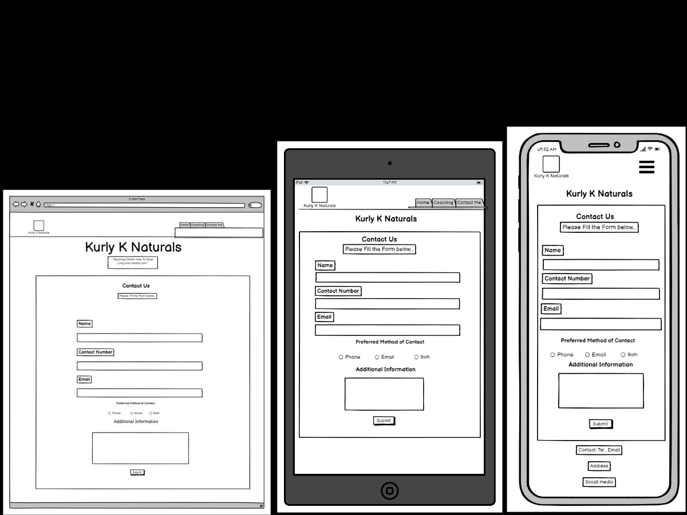

# About Kurly K Naturals 

Kurly K Naturals is a business website I created for my MS1 project with Code Institute.

The goal of Kurly K Naturals is to  help people to maintain and grow strong, healthy hair using organic natural products. The majority of people within the Afro-Carribean community have found it difficult to take care of their hair and will often end up using products that can damage their hair in the long run. This can lead to depression, losing confidence as we all want to look and feel as good as possible. Kurly K offers a range of coaching services which allows them to focus solely on their clients and to tailor a hair regime that is best suited for their hair. They also offer group classes to those that don't want to do a one on one. This is great for clients as it allows them a platform to network and to socialise. The final coaching service is our online video tutorials on Youtube as they are passionate about helping others. We felt that it would be great to offer free content to everyone to help raise awareness on healthy hair. Finally Kurly K also offers complimentary Homemade natural products to their clients to compliment their hair regime programs.

The purpose for the website is to give the users more information about the products and services we offer at Kurly K Naturals. It will also allow us to showcase our results and the testimonials from previous clients. It will be important for Kurly K to have a contact form to enable people to get in touch. Whilst we want to also have links to social media to increase the footfall on these platforms. As the business grows there will be potential to expand this website in the future.

# User Experience

# Strategy

## User Stories

Reasons why somebody may visit the website:
* A User looking for more knowledge on how to maintain their Healthy Hair.
* A User looking for a Coach
* A User that is interested in purchasing organic hand made hair products from a trustful supplier.
* A User looking for Online Videos on Hair Growth
* Previous customer looking for a new product or service

Reasons for a website
* Allows people to get a clearer understanding of the business.
* Increase potential customers
* Allows a method for New and Existing methods to contact the business.
* Potential to grow the Social Media for the business
* Builds trust by showcasing the business

# Scope

What does the user expect?
* Information about Kurly K and the products and services they offer
* A method to contact the business
* Easy to use website
* Clear and Concise information

What may the user want?
* Social Media Information
* Contact details to speak to somebody
* To gain a  understanding on the products & service being offered
* To see if the business has credentials
* Read Reviews

What do I expect?
* Easy Navigation
* Balanced Color theme
* I want the theme to represent the business
* The site to be accessible on every device

# Structure

The website will have 3 Separate Web Pages which are:
* A home page which will provide information about Kurly K Naturals, It will touch on the products and services we offer and the benefits of them.
* A Offers page which will take a closer look at the services and the products that Kurly K  are offering.
* A Contact page that has a form to contact the business.
*** 
# Designs
# Surface
## Colour 

I decided to use Dark Brown as my main colour theme for the website. After Using Contrast checker I decided to pair this with an off-white colour for contrast. This will boost the accessibility for visually impaired users. This goes with the theme of the website and the business. I also included black and a medium shade of brown to add a bit of diversity to the color scheme whilst keeping it stylish.

These colours feature several times throughout the website which is why I have set a variable roots in the code to make it easier for myself to stay on track..

I have used the following colors:

(Image)

The best thing about using the variable method is that if a change in color or theme needs to occur i can do this by simply changing a root color. The only other Color i used was Gold which was used as a hover feature for my buttons in the header section.
 
I used https://www.webfx.com/web-design/color-picker/ to help me identify the main color that I wanted to use. Initially i decided to go with a bronze/brown theme. One this was decided I then used https://webaim.org/resources/contrastchecker/ to identify suitable matching colors by contrast for my main color to ensure the website provided quality visibility.

## Typography

I have used https://fonts.google.com/ for my fonts. I chose Cororande Grande  as my main font throughout the website and used sans-serif as my back up font. This is a unique style that is easy to read and looks very stylish at a range of sizes. I believe that the slick look suits the nature of the business which makes it a great match..

I used different font weights for the headers and adjusted the size to make it visually clear for the user.

## Nav links

* I made the Nav links as easy and simple to use to increase the accessibility across the website.
* The button links highlight a different color when you hover the mouse over to help make it obvious that it's a link.
* The submit button on the contact form was styled to make the form look even better.
* The “Contact us"  button in the main body of the Homepage  takes them directly to the form.
* The social media links in the footer will send the user to the company's social media pages. 

## Imagery 

This was one of the most important aspects for the business, the reason is that this business is in the Hair and Beauty sector and a lot of the decisions will be made visually. I focused on gathering images that were bold and catchy on the eye. The hero image on the homepage and offers page had to represent the nature of the business. I wanted it to show beauty and family between a mother and a child.

I also included some original photos from the actual business. These images are  progress images that show off the actual service and the achievements of Hair growth. I also used pictures of the products that are homemade and packaged where I then took the pictures and uploaded this onto the website. I felt that this offers more originality and wants to give a clearer insight into the business.

I used a gold pattern background-image for the "Contact us" page. I felt like the gold-background represents a positive and exciting theme and putting this in the contact page was best suited for this.
 (Add Image Links)

 # Skeleton

 ## Layout
* I used responsive design to build the website. This is to avoid having any issues when the website is being viewed on different screen sizes, where you will be able to view more content on a larger screen whilst on a smaller screen the content adjusts to be viewed in a suitable manner.
* Media queries were used to ensure that the content looked good on different screen sizes.
* I used Bootstrap 4 to help build grids and my Carousel testimonial.
* I also used CSS to style the layout to ensure that the paddings, margins and positioning of my layouts looked good.
## Homepage WireFrame

## Service WireFrame

## Form WireFrame
