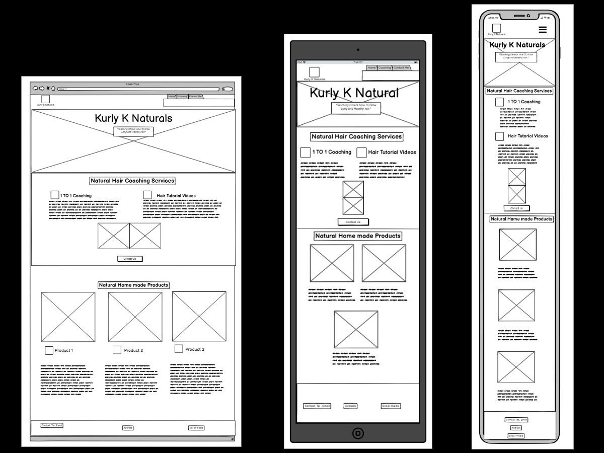
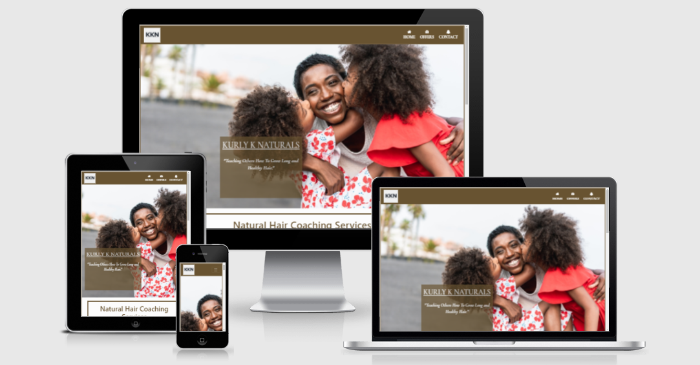
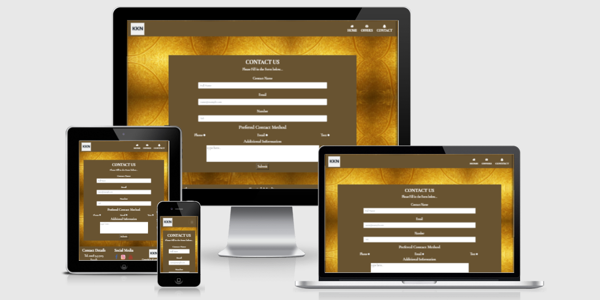

# Kurly K Naturals

[Link To Live Website](https://bocks90.github.io/KurlyKNaturals/)

[Repository](https://github.com/Bocks90/KurlyKNaturals)

# About 

Kurly K Naturals is a business website I created for my MS1 project with Code Institute.

The goal of Kurly K Naturals is to  help people to maintain and grow strong, healthy hair using organic natural products. The majority of people within the Afro-Carribean community have found it difficult to take care of their hair and will often end up using products that can damage their hair in the long run. This can lead to depression, losing confidence as we all want to look and feel as good as possible. Kurly K offers a range of coaching services which allows them to focus solely on their clients and to tailor a hair regime that is best suited for their hair. They also offer group classes to those that don't want to do a one on one. This is great for clients as it allows them a platform to network and to socialise. The final coaching service is our online video tutorials on Youtube as they are passionate about helping others. We felt that it would be great to offer free content to everyone to help raise awareness on healthy hair. Finally Kurly K also offers complimentary Homemade natural products to their clients to compliment their hair regime programs.

The purpose for the website is to give the users more information about the products and services we offer at Kurly K Naturals. It will also allow us to showcase our results and the testimonials from previous clients. It will be important for Kurly K to have a contact form to enable people to get in touch. Whilst we want to also have links to social media to increase the footfall on these platforms. As the business grows there will be potential to expand this website in the future.
# Table Of Contents
* [User Experience (UX)](#user-experience)
* [Designs](#designs) 
* [Features](#features)
* [Technology Used](#technology-used)
* [Testing](#testing)
* [Bugs](#bugs)
* [Deployment](#deployment)
* [Acknowledgements](#acknowledgements)

# User Experience

# Strategy

## User Stories

Reasons why somebody may visit the website:

* A user who has information but wants to speak to somebody
* A User who wants to find out if the business is reliable
* A User looking for Online Videos on Hair Growth
* A User that is interested in organic hand made hair products from a trustful supplier.
* A user looking for a Hair Coach
* A User looking for more information on what the business offers.
* Previous Customer looking for a new product or service

Reasons for a website
* Allows people to get a clearer understanding of the business.
* Increase potential customers
* Allows a method for New and Existing methods to contact the business.
* Potential to grow the Social Media for the business
* Builds trust by showcasing the business

# Scope

What does the user expect?
* Information about Kurly K and the products and services they offer
* A method to contact the business
* Easy to use website
* Clear and Concise information

What may the user want?
* Social Media Information
* Contact details to speak to somebody
* To gain a  understanding on the products & service being offered
* To see if the business has credentials
* Read Reviews

What do I expect?
* Easy Navigation
* Balanced Color theme
* I want the theme to represent the business
* The site to be accessible on every device

# Structure

The website will have 3 Separate Web Pages which are:
* A home page which will provide information about Kurly K Naturals, It will touch on the products and services we offer and the benefits of them.
* A Offers page which will take a closer look at the services and the products that Kurly K  are offering.
* A Contact page that has a form to contact the business.
*** 
# Designs
# Surface
## Colour 

I decided to use Dark Brown as my main colour theme for the website. After Using Contrast checker I decided to pair this with an off-white colour for contrast. This will boost the accessibility for visually impaired users. This goes with the theme of the website and the business. I also included black and a medium shade of brown to add a bit of diversity to the color scheme whilst keeping it stylish.

These colours feature several times throughout the website which is why I have set a variable roots in the code to make it easier for myself to stay on track..

I have used the following colors:

 

The best thing about using the variable method is that if a change in color or theme needs to occur i can do this by simply changing a root color. The only other Color i used was Gold which was used as a hover feature for my buttons in the header section.
 
I used [Web Fx](https://www.webfx.com/web-design/color-picker/) to help me identify the main color that I wanted to use. Initially i decided to go with a bronze/brown theme. One this was decided I then used [WebAim](https://webaim.org/resources/contrastchecker/) to identify suitable matching colors by contrast for my main color to ensure the website provided quality visibility.

## Typography

I used [Google Fonts](https://fonts.google.com/) for my fonts. I chose Cororande Grande  as my main font throughout the website and used sans-serif as my back up font. This is a unique style that is easy to read and looks very stylish at a range of sizes. I believe that the slick look suits the nature of the business which makes it a great match..

I used different font weights for the headers and adjusted the size to make it visually clear for the user.

## Nav links

* I made the Nav links as easy and simple to use to increase the accessibility across the website.
* The button links highlight a different color when you hover the mouse over to help make it obvious that it's a link.
* The submit button on the contact form was styled to make the form look even better.
* The “Contact us"  button in the main body of the Homepage  takes them directly to the form.
* The social media links in the footer will send the user to the company's social media pages. 

## Imagery 

This was one of the most important aspects for the business, the reason is that this business is in the Hair and Beauty sector and a lot of the decisions will be made visually. I focused on gathering images that were bold and catchy on the eye. The hero image on the homepage and offers page had to represent the nature of the business. I wanted it to show beauty and family between a mother and a child.

I also included some original photos from the actual business. These images are  progress images that show off the actual service and the achievements of Hair growth. I also used pictures of the products that are homemade and packaged where I then took the pictures and uploaded this onto the website. I felt that this offers more originality and wants to give a clearer insight into the business.

I used a gold pattern background-image for the "Contact us" page. I felt like the gold-background represents a positive and exciting theme and putting this in the contact page was best suited for this.
 (Add Image Links)

[Background Image](https://github.com/Bocks90/KurlyKNaturals/blob/master/assets/images/goldbackground1.jpg)

[Logo Image](https://github.com/Bocks90/KurlyKNaturals/blob/master/assets/images/logo.jpg)

[Hero Image 1](https://github.com/Bocks90/KurlyKNaturals/blob/master/assets/images/COVER.jpg)
[Hero Image 2](https://github.com/Bocks90/KurlyKNaturals/blob/master/assets/images/servicecoverimg.jpg) 

[Offer-Box Image 1](https://github.com/Bocks90/KurlyKNaturals/blob/master/assets/images/coaching1.jpg)
[Offer-Box Image 2](https://github.com/Bocks90/KurlyKNaturals/blob/master/assets/images/productkurlyk1.jpg)

[Service Image 1](https://github.com/Bocks90/KurlyKNaturals/blob/master/assets/images/IMG-20210206-WA0007.jpg)
[Service Image 1](https://github.com/Bocks90/KurlyKNaturals/blob/master/assets/images/IMG-20210206-WA0019.jpg)

[Products Image 1](https://github.com/Bocks90/KurlyKNaturals/blob/master/assets/images/arymedicbottl.jpg)
[Products Image 2](https://github.com/Bocks90/KurlyKNaturals/blob/master/assets/images/bodybutter.jpg)
[Products Image 3](https://github.com/Bocks90/KurlyKNaturals/blob/master/assets/images/milk_honey.jpg)

[Testimonial 1](https://github.com/Bocks90/KurlyKNaturals/blob/master/assets/images/testimonial1.jpg)
[Testimonial 2](https://github.com/Bocks90/KurlyKNaturals/blob/master/assets/images/testimonial2.jpg)
[Testimonial 3](https://github.com/Bocks90/KurlyKNaturals/blob/master/assets/images/testimonial3.jpg)

 # Skeleton

 ## Layout
* I used responsive design to build the website. This is to avoid having any issues when the website is being viewed on different screen sizes, where you will be able to view more content on a larger screen whilst on a smaller screen the content adjusts to be viewed in a suitable manner.
* Media queries were used to ensure that the content looked good on different screen sizes.
* I used Bootstrap 4 to help build grids and my Carousel testimonial.
* I also used CSS to style the layout to ensure that the paddings, margins and positioning of my layouts looked good.
## Homepage WireFrame

## Service WireFrame

## Form WireFrame

## Mockup

# Features
## Features Across the Site

### Header
The Navigation bar can be found  on the Header Section on every page. The links have the hover feature which turns the writing Gold when you hover your mouse over the text. They will navigate you to the page you select. I also included a Logo image link which sits on the left side of the header. This link simply redirects you to the homepage. The header needed to be responsive so I used Bootstrap  4 to build the grid and added the class “navbar-expand-sm” to enable the nav bar to collapse on a smaller screen to improve usability. The main color brown has been applied to the background of the header.
### Footer
The footer was built in 3 separate sections which are “Contact details”, “Social Media” and “logo”. I used bootstrap to arrange the layout so that the three sections will stack on top of each other when using a smaller device. The contact details simply has our Telephone and Email address to contact the business on. The Social Media section has direct links to the social media platforms (Facebook, Instagram and Youtube). Once you click on the icons it will navigate you straight to the social media pages. The icons are the logo which was taken from Font Awesome. They have a hover feature that changes color when you hover the cursor over it. The footer uses the main brown theme as a background with off-white text.
### Responsiveness
The website has been built to be responsive for all devices. To do this i used the media query technique in CSS to adjust the service section to make it responsive with smaller devices. I also used Bootstrap with some of the grids too.
### Accessibility
Links are consistent and they all work fine. I have set a suitable contrast to match the background in each section to make the site viewable to a range of readers. Social media links work. I have included alt and aria-label attributes to all of my images and nav links to make the site easier for visual impairments. Whilst font has been set to rem so that the font size increases automatically for somebody using large font settings.
### Meta data
* I have included Meta data to boost SEO results and have given every page on the website its own title so that you can notice what page your on form looking at the tab.
### Homepage Features
* The Hero Image has a Cover box over it which says the Company name (Kurly K Naturals) with the slogan "Teaching Others How To Grow Long and Healthy Hair". The box has a lower opacity to make it visually smoother. 
* The Offer section has a paragraph that talks about what the business offers. It also has two images one represents the products and the other services. When viewed on a smaller screen the images stack on top of each other.
* The Benefits section has an ordered list with bullet points that states the benefits of the business.
* The homepage has two extra links in the body "Products & Services" redirects you to offers page and "Get in Touch" will redirect you to the contact page. 
* The Testimonial is a  carousel styled layout that slides from one testimonial to the other. This was built using Bootstrap where I then changed the color to suit the theme of the website.
### Offers Features
* The Hero Image has the same features as the homepage image. The only difference was the image used.
* The Service section has two paragraphs aligned side by side with each other that explain the services we offer. The paragraphs fall on top of each other when viewed on smaller screens. This section also has two images side by side that respond the same as the text. Below this is a contact us button that directs you to the Contact us page.
* The Products section consists of 3 divs placed side by side with another. Inside each div you have a header with the products name with the image below, followed be a description of the product. On smaller devices the div sections fall on top of each other.
### Contact Features
* The form was built to appear differently depending on the screen sizes to improve the visual appearance. ( This can be seen in the Contact us section)
* The form has a field to enter your Name using text which was done using the input=’”text”
* The email section has been set to accept email addresses only within this box.
* The number section also requires a number before you are able to submit.
* The Radio button feature is used to select the contact type. This was used as i felt this is a suitable method to get the information required form the user.
* The Text Area is there to allow the user to give me additional information on their reasons for getting in contact.
* The Submit Button included at the bottom of the form.
### Future Features
* Once the business grows there will be a need to include a shopping basket with a checkout section to allow the business to process orders on the website.
* Allow customers to create user accounts and have their own profile which they can use to track their progress and speak with other customers on their journey.
* Add tutorial videos to the website to allow users to view some content whilst browsing our website.
* A map with the business location on the contact us page.
# TECHNOLOGY USED
* HTML 5
* CSS 3
* Github - To Store the repository 
* Gitpod - Integrated Development Environment
* Git - For Version control
## Design
* Bootstrap - this was used for responsive designs on grids and a carousel on the website.
* Google Fonts - Used to select my font for the website.
* Balsamiq - Creating Wireframes
* Font Awesome - For icons on the website.
* IMG 2 GO - Resize images to make the browser run smoothly.
# Testing
## Demo Testing
The First thing I tested were the features that appear on the browser by demo testing the website for errors.  
* The text links in the navbar all work and direct you to the correct pages.
* The Contact Us button link directs the user straight to the contact form.
* Social Media links all work
## W3C
### HTML Validator
 

### CSS Validator

W3C markup validator was used to check the website for semantic and syntax errors. The browser passed the test for both HTML and CSS validating my code.
## Performance Testing
### Lighthouse 
I tested my results on Lighthouse and these were my results the first time:

 

Accessibility was a big issue that I had with my performance results. To boost this I added aria-labels to all of my links. To boost my performance results I compressed my image sizes to increase the load time. Whilst adding metadata to improve my SEO score which gave me the results below.

### Browser Compatibility
The website has been tested on a range of browsers (Google Chrome, Firefox, Safari, Microsoft Edge and brave). The website is working and functioning well on all browsers. To do this I demo tested the website on these browsers as stated above in te demo testing section
### OS Compatibility
Tested the website on Windows 10, Android and iOS. The aim was to view the responsive changes on different devices.
### Usability Testing
I sent my project to my fellow students in the slack community and a few friends that work in the industry with experience to double check that all of my links are working and that the content is responsive.
## Testing User Stories
### A User looking for more information on what the business offers.
* The Homepage talks about the products and services that the business offer briefly alongside the benefits. The offer page talks about the this in more depth to provide more information.
 ### A user looking for a Hair Coach
* The user will be able to see that they can find a hair coach from the moment they click on the website and view our slogan on the Hero Image. There are a range of links that will direct the user to the contact us page.
### A User that is interested in organic hand made hair products from a trustful supplier.
* You can view the homemade hair products that the business offers. All products have a description which talks about the benefits of the product. Users can enquire about the products using the contact us form.
### A User looking for Online Videos on Hair Growth
* The Service section under the online tutorial mentions that you can access our tutorial videos on Youtube and Instagram. The link is on every page on the footer which will direct you to  the social media pages.
### Previous Customer looking for a new product or service
* A customer may use the products and want to try a service to compliment the products then they could do this, as we have a variety of things to offer.
### A User who wants to find out if the business is reliable
* The testimonial section shows feedback from previous clients, also there are images that show the progress of our coaching service on the offers page.
### A user who has information but wants to speak to somebody
* The User can find our information in the footer and can also use the contact us section to speak to somebody.
# Bugs
The scroller in my Carousel for Testimonials wasn’t working. When i would click on it a 404 error message would appear in a separate tab. I realised that there was a typos with my id. Once i changed the coding the scroller worked perfectly fine.

I had an issue with my products section where I was unable to center the text using the text-align element on CSS. I realised the issue was that I built the section using bootstrap which had an impact on my css code. I used the Text-center attribute in HTML for images which fixed the issue.

I received a 404 error message once I deployed my  website. This stopped my images from showing on my website when it was deployed for some of my images. I realised that the issue was that i put ../ on the file path which isn't being picked up by the browser. One i changed the relative file path to  assets/images/coaching1.jpg and used this method for the other broken pictures this fixed the issue.

[404 error message](https://github.com/Bocks90/KurlyKNaturals/blob/master/readmefiles/404error.png)

An error occurred because i had nested an element within a button element which showed as an error when i attempted to do my HTML validator..  This was a mistake that was easy to fix once i understood that this rule couldn't happen. I removed the button element and changed the CSS to affect the (a) element to keep the link stylish . Once i changed this my HTML validator passed the test.

[HTML VALIDATOR](https://github.com/Bocks90/KurlyKNaturals/blob/master/readmefiles/htmlerror.png)

In the Products section which was built using Bootstrap, I was having issues centering the third div on a medium screen device. To fix the issue i changed the code div to occupy the full column on a medium screen. 

# Deployment
This project was developed on Gitpod Workspaces Workspaces IDE committed and pushed to my Github Repository using Gitpod Command Line interface.
## Adding and Committing Files
To add files to the repository I used the git add command. I then used the git commit command to highlight changes being made to the code.  When I was happy with this I then used the Git Push command  to push the code to my Github repository.  
## Deployment
To make this website accessible i used the following steps to deploy the website
1. Logged into my github account
2. Clicked the "Settings" button on the menu page
3. Scroll down to the "GitHub Pages" Section.
4. Click  the dropdown menu  called "None" and select "Master Branch".
5. Click save.
6. The page will refresh and the website is now deployed.
7. To find the link to the website go to the Github Pages Section and the link is there with the published website.
## Forking
Forking the GitHub Repository will copy it in your own repositories in GitHub, This allows us to view or make changes without the changes affecting the original. 
Making a local clone:
* Log into GitHub 
* Navigate to the GitHub Repository.
* Click on the fork button at the top of the page.
* You should now have a new copy of the repository in Github.
## Cloning
Making a Local Clone  to create a copy of your repository from Github to store locally on your device  is known as “cloning a repository”. To clone a repository you need to follow these steps:
* Log into GitHub and locate the gitpod repository
* Select the button that says "Clone or download". Under the repository name.
* To clone the repository using HTTPS simply copy the link underneath "Clone with HTTPS".
* Open Gitbash
* Change the current working directory to the location where you want the cloned directory to be.
* Type “git clone”, and then paste the URL you copied earlier.

* Press enter to create your local clone.

# References
[Code Institue Sample Readme](https://github.com/Code-Institute-Solutions/SampleREADME) - Helped Structure my Readme

[Web Development Tutorials](https://youtu.be/UE-tiUh3W3U) - Used this Bootstrap tuturial to help build my Testimonial Carousel

[PngTree](https://pngtree.com/back/down?id=MTIwNTY2NA==&type=1&time=1613498482&token=OWRkOGM4N2QzZDJmZGYyZDMxZjhjNDVmN2MxNmJjNDg=) - Gold Background Image

[Shutterstock](https://www.shutterstock.com/home) - Purchased my Hero and Testimonials Images from this website.

[Computer Hope](https://www.computerhope.com/issues/ch001662.htm) - All images are owned or bought from Shutterstock

[W3C Schools](https://www.w3schools.com/) - Helped me with a range of codes and solving issues.

[Balsamiq wireframes](https://balsamiq.cloud/spaces) - Used this website to build my wireframes.

[Red Route](https://red-route.org/code/image-resizing-calculator) - Resize my images whilst keeping the same proportions

[Bootstrap](https://getbootstrap.com/docs/4.5/getting-started/introduction/)- Used to build Carousel and Responsive grids.

[HTML Validator](https://validator.w3.org/) - Tested my HTML code

[CSS Validator](https://jigsaw.w3.org/css-validator/) - Tested my CSS code

[Font Awesome](https://fontawesome.com/) - Cdn for icons used on website

[Google Fonts](https://fonts.google.com/) - Cdn for fonts used on website

[Am I Responsive](http://ami.responsivedesign.is/#) - Checks responsiveness on different viewport devices

## Code
Bootstrap was used to build my tesitmonials and grids on the website. I used the bootstrap code from [Web Development Tutorials](https://youtu.be/UE-tiUh3W3U) to do this.

# Acknowledgements
* Bayo Sodimu - Friend and Mentor who helped to provide advice and tips. Proof read my work and provided advice.
* My Code Institute Whats App Group for testing my website and take the time to give constructive feedback and regular support
* Slack community for providibf regular support
* Code Institute provided me with a template to build the website and teaching nme HTML and CSS
  
  